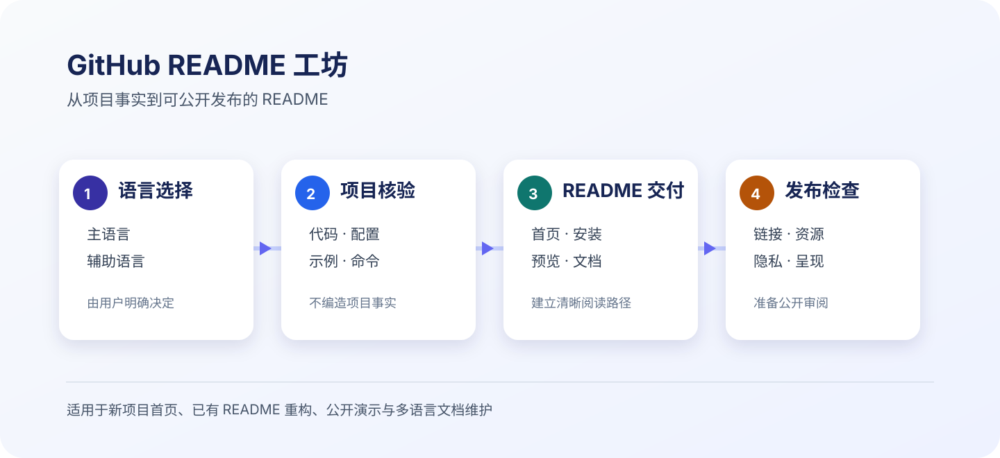

# GitHub README Craft

[简体中文](README.md) · [English](README.en.md)

> A reusable skill for AI agents with repository access. It turns verified project facts, usable commands, visual evidence, and publishing checks into a clear, maintainable GitHub README.

<p align="center">
  <a href="SKILL.md" title="Read the full workflow">
    
  </a>
  <br>
  <sub>Workflow illustration. Select it to read the complete skill specification.</sub>
</p>

## What it does

The skill helps an agent prepare a repository landing page without inventing facts. It asks the user to choose the primary and optional README languages, verifies claims and commands against the repository, adds useful visual demonstrations, and checks public-facing content for common privacy issues.

## Workflow

| Stage | Agent action | Evidence produced |
| --- | --- | --- |
| 1. Language selection | Ask the user to choose a primary language and optional variants | Visible language links and the requested README files |
| 2. Project verification | Inspect code, manifests, examples, builds, and deployment configuration | Verified description, commands, and links |
| 3. README delivery | Write the landing page, examples, installation path, and documentation entry points | A readable first-visitor experience |
| 4. Publishing checks | Validate relative paths and common sensitive-content patterns | Documentation ready for public review |

See the [skill specification](SKILL.md) and the [README playbook](references/readme-playbook.md) for the full procedure.

## Install in Codex

```bash
mkdir -p "${CODEX_HOME:-$HOME/.codex}/skills"
git clone https://github.com/Zimzheng/github-readme-craft.git "${CODEX_HOME:-$HOME/.codex}/skills/github-readme-craft"
```

To update an existing clone:

```bash
cd "${CODEX_HOME:-$HOME/.codex}/skills/github-readme-craft"
git pull --ff-only
```

## Use

```text
Use $github-readme-craft to improve the README in this repository.
Primary language: Simplified Chinese. Optional language: English.
```

The skill asks for a language selection before inspecting or editing a README when that choice is not supplied.

## Validate a README

```bash
python3 scripts/validate_readme.py README.md --repo-root .
python3 scripts/validate_readme.py README.en.md --repo-root .
```

The validator checks titles, relative image and link targets, and common local-path or credential patterns. Review project facts, external links, and visual quality in the target repository as well.

## Repository layout

```text
.
├── SKILL.md
├── README.md
├── README.en.md
├── agents/openai.yaml
├── assets/readme-craft-workflow.svg
├── references/readme-playbook.md
└── scripts/validate_readme.py
```
